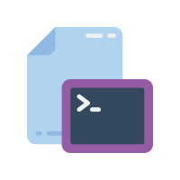

<!-- PROJECT LOGO -->
<br />
<p align="center">
  <a href="https://github.com/JackHumphries9/typescript-cli-template">
    
  </a>

  <h3 align="center">Typescript CLI Template</h3>

  <p align="center">
    A template for creating CLIs with Typescript, Chalk and Commander
  </p>
</p>

<!-- TABLE OF CONTENTS -->

## Table of Contents

-   [About the Project](#about-the-project)
-   [Built With](#built-with)
-   [Getting Started](#getting-started)
-   [Common Problems](#common-problems)
-   [Roadmap](#roadmap)
-   [Contributing](#contributing)
-   [License](#license)
-   [Contact](#contact)

<!-- ABOUT THE PROJECT -->

## About The Project

This is a template for creating CLIs with Typescript, Chalk and Commander. It allows you to quickly create a CLI without having to worry about the setup.

(Icon by [Smashicons]("https://www.flaticon.com/free-icons/command-line"))

### Built With

-   [Commander.js](https://github.com/tj/commander.js)
-   [Chalk](https://github.com/chalk/chalk)
-   [Typescript](https://github.com/microsoft/TypeScript)

<!-- GETTING STARTED -->

## Getting Started

To get a local copy up and running follow these simple steps.

Clone the repo (or you can click the "Use this template" button to create a new repo from this template):

```sh
git clone https://github.com/JackHumphries9/typescript-cli-template.git
```

Install NPM packages:

```sh
npm i
```

Run the example command:

```sh
npm run build && node ./dist/index.js hello
```

You should change the name, the name of the binary, version and description of the project in the `package.json` file as well as add your name to the author field.

If you want to build your command so you can test it anywhere, run:

```sh
npm run build && npm i -g
```

Then you can run your command anywhere:

```sh
$ my_command

Your command is working!
```

## Common Problems

Heres a list of common problems you may encounter when using this template.

### Importing files

If your trying to import another file in the `src` directory, you may get an error like this:

```sh
Error: Cannot find module '/x/y/z/typescript-cli-template/dist/your_file.ts' imported from /x/y/z/typescript-cli-templatee/dist/index.js
```

This is because the `tsconfig.json` file is set to use the latest version of ES. You have to import your file with the `.js` extension:

```ts
import { YourFuncs } from "./your_file.js";
```

### Publishing to NPM

If the command your trying to publish already exists on npmjs, you will get an error which states it is the same or similar to an existing package. To fix this, you need to change the name of the binary in the `package.json` file. Either use a more abstract name or add a prefix to the name (i.e. `@your-npm-username/your_command`). You will also need to change the name of the package in the `package.json` file.

## Roadmap

See the [open issues](https://github.com/JackHumphries9/jwter/issues) for a list of proposed features (and known issues).

<!-- CONTRIBUTING -->

## Contributing

Contributions are what make the open source community such an amazing place to be learn, inspire, and create. Any contributions you make are **greatly appreciated**.

1. Fork the Project
2. Create your Feature Branch (`git checkout -b feature/AmazingFeature`)
3. Commit your Changes (`git commit -m 'Add some AmazingFeature'`)
4. Push to the Branch (`git push origin feature/AmazingFeature`)
5. Open a Pull Request

## License

Distributed under the GNU General Public License v3.0 License. See `LICENSE` for more information.

## Contact

Jack Humphries - me@jackhumphries.io

Project Link: [https://github.com/JackHumphries9/typescript-cli-template](https://github.com/JackHumphries9/typescript-cli-template)
